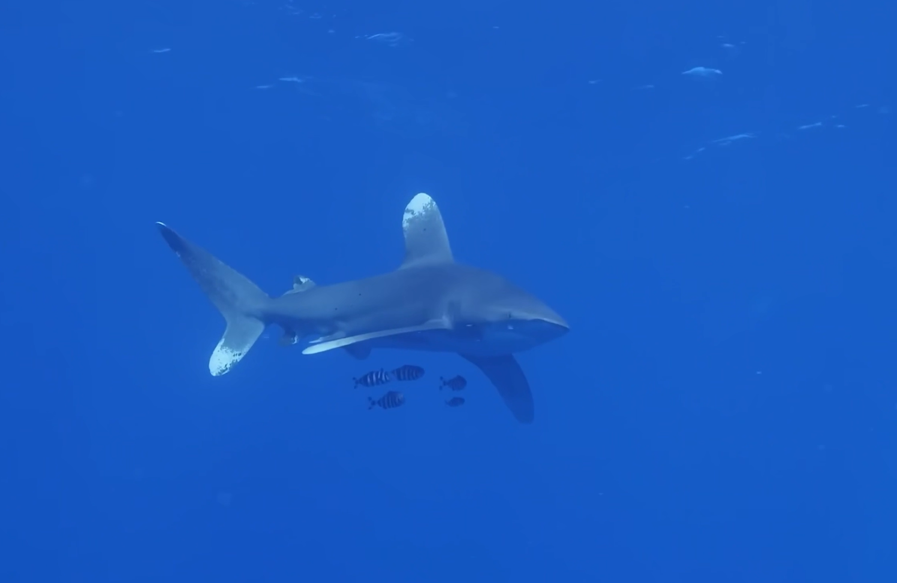
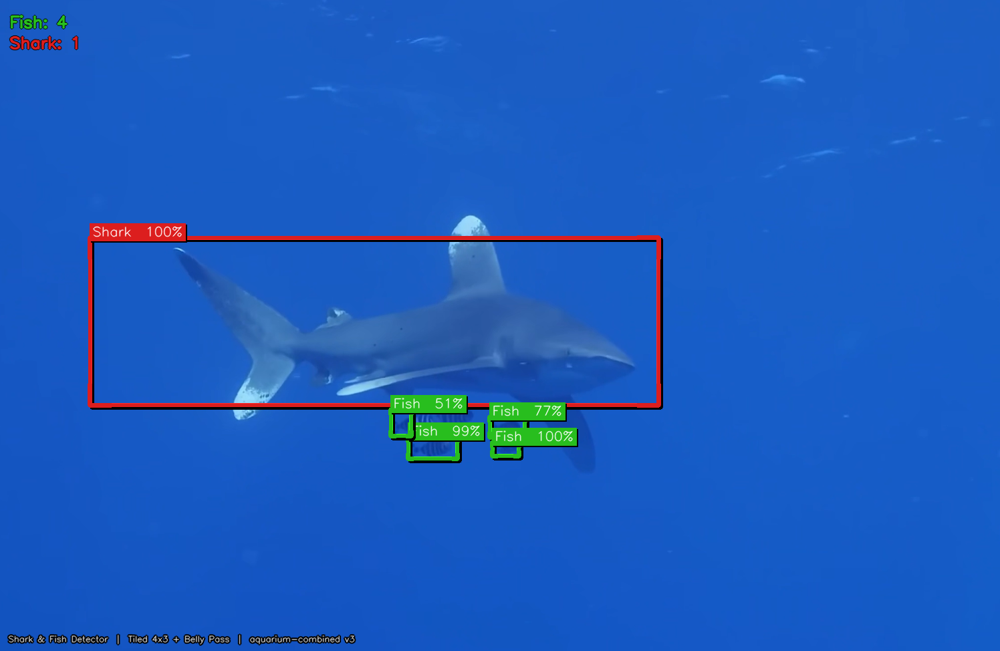

# Shark & Fish Detector

Real-time shark and fish detection in 4K underwater footage using **YOLOv26** via the Roboflow `aquarium-combined/3` model.

---

## Demo

### Output Video
https://github.com/user-attachments/assets/output-2.mp4

### Detection — Input vs Output
| Original | Detected |
|----------|----------|
|  |  |

---

## What It Detects

| Scene | Mode | Detection |
|-------|------|-----------|
| 0–7s | **SWARM** | 15–20 hammerhead sharks via 4×3 tiled inference |
| 7–15s | **SINGLE** | 1 oceanic whitetip + pilot fish via 3-pass pipeline |

---

## How It Works

- **SWARM mode** — splits each 4K frame into a 4×3 grid of tiles, runs YOLOv26 inference on all 12 tiles + a full-image bonus pass. Catches faint background sharks missed by single-pass.
- **SINGLE mode** — 3-pass pipeline: full image → shark crop zoom → belly-region tiles (3× upscale) to catch small pilot fish.
- **Auto scene switching** — hardcoded transition at frame 168 (7s mark) for perfect mode accuracy.
- **Interpolation** — detections inferred every 6 frames, linearly interpolated between keyframes for smooth bounding boxes.
- **CLAHE enhancement** — contrast boost to cut through underwater blue cast before inference.

---

## Setup

```bash
git clone https://github.com/fadil013/shark-fish-detector
cd shark-fish-detector
pip install opencv-python numpy requests python-dotenv
cp .env.example .env
# Add your Roboflow API key to .env
```

`.env`:
```
ROBOFLOW_API_KEY=your_key_here
```

---

## Run

**Images:**
```bash
python test_images.py
```

**Video:**
```bash
$env:PYTHONIOENCODING="utf-8"; python test_video.py
```

Output: `output.mp4` (~20 min for 4K 15s video, ~800 API calls)

---

## Files

| File | Purpose |
|------|---------|
| `test_video.py` | Video detector — swarm + single mode, interpolation |
| `test_images.py` | Image detector — same dual-mode pipeline |
| `detect_fish.py` | Production version with SORT tracker + Kalman filter |
| `.env.example` | API key template |

---

## Model

**YOLOv26** · Roboflow `aquarium-combined/3`  
Classes: shark, fish, stingray, jellyfish, and more.
